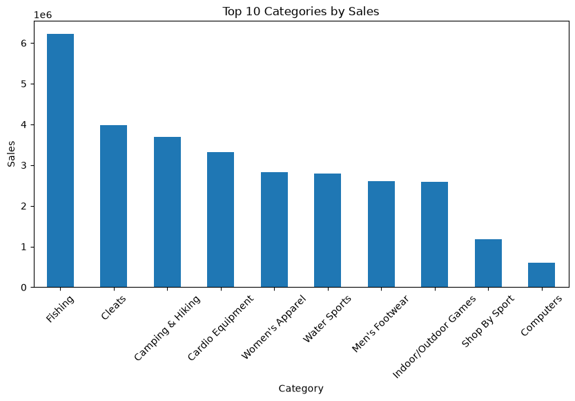

# 🚚 Supply Chain Analytics & Decision Support Dashboard

> **An interactive data-driven platform for exploring, analyzing, and forecasting supply chain performance across sales, products, geography, delivery operations, and demand.**

<p align="center">

**Python • Pandas • Plotly • Streamlit • Data Analytics • Supply Chain Management**

</p>

---

## 📌 Overview

The **Supply Chain Analytics & Decision Support Dashboard** is an interactive analytics application designed to transform raw supply chain transaction data into meaningful operational insights.

The system integrates **data cleaning, exploratory analysis, KPI monitoring, interactive visualization, geographic analysis, product-level analysis, delivery performance analysis, and sales forecasting** into a single Streamlit-based platform.

Rather than treating supply chain data as static records, the project focuses on converting operational data into **actionable information that can support better managerial and supply chain decisions.**

### Core Perspective

**Raw Data → Data Processing → Analytics → Visualization → Insight → Decision Support**

---

## 🎯 Problem Statement

Modern supply chains generate large volumes of transactional and operational data. However, raw data alone does not provide decision-makers with a clear understanding of:

* How sales are changing over time
* Which products contribute most to business performance
* Which geographical regions generate stronger demand
* Where delivery performance may require attention
* How sales may evolve in the future
* Which patterns and trends are hidden within historical transactions

This project addresses these challenges by developing an **interactive analytical environment** where supply chain data can be explored from multiple operational perspectives.

---

## 🔍 Project Objectives

The primary objectives of the system are to:

1. **Transform raw supply chain data into an analysis-ready dataset**
2. **Monitor important sales and operational KPIs**
3. **Identify temporal sales and profit patterns**
4. **Analyze product-level performance**
5. **Explore geographical sales distribution**
6. **Evaluate delivery-related performance**
7. **Analyze historical sales behavior**
8. **Generate sales forecasts from historical patterns**
9. **Provide interactive visual analytics for decision support**
10. **Create a foundation for future optimization and advanced supply chain analytics**

---

# 📊 Analytical Modules

The dashboard is organized into several analytical modules.

## 1️⃣ Sales Analytics

Provides a comprehensive view of sales performance through:

* Sales trends
* Monthly sales analysis
* Profit trends
* KPI monitoring
* Historical performance analysis
* Interactive filtering

**Purpose:** Understand how business performance changes over time and identify important sales patterns.

---

## 2️⃣ 🌍 Geographic Analytics

Analyzes supply chain performance from a geographical perspective.

The module helps explore:

* Regional sales distribution
* Geographic demand patterns
* Market-level performance
* Location-based sales concentration

**Purpose:** Identify geographical patterns that can support market analysis and distribution-related decisions.

---

## 3️⃣ 📦 Product Analytics

Provides product-level performance insights.

The analysis focuses on:

* Product performance
* Sales contribution
* Product-level trends
* Comparative product analysis

**Purpose:** Understand which products are driving business performance and where product-level attention may be required.

---

## 4️⃣ 🚚 Delivery Analytics

Examines delivery-related information contained within the supply chain dataset.

The module provides an analytical view of:

* Delivery performance
* Delivery-related patterns
* Operational behavior
* Potential areas requiring further investigation

**Purpose:** Support the identification of operational patterns that may affect supply chain service performance.

---

## 5️⃣ 🔮 Sales Forecasting

The forecasting module uses historical sales information to explore future sales behavior.

It provides:

* Historical sales analysis
* Forecast visualization
* Trend identification
* Future-oriented analytical insights

**Purpose:** Demonstrate how historical supply chain data can be used as a foundation for **demand and sales planning**.

> **Note:** The forecasting component is intended as an analytical forecasting module and can be further enhanced with advanced time-series and machine-learning methods.

---

# 🧠 Decision-Support Perspective

The main value of this project is not simply the visualization of charts.

The dashboard is designed around the following decision-support framework:

| Supply Chain Question                  | Analytical Approach   |
| -------------------------------------- | --------------------- |
| How are sales performing?              | Sales & KPI Analytics |
| How is performance changing over time? | Trend Analysis        |
| Which products are important?          | Product Analytics     |
| Where is demand concentrated?          | Geographic Analytics  |
| How is delivery performing?            | Delivery Analytics    |
| What could happen next?                | Sales Forecasting     |
| How can managers explore the data?     | Interactive Dashboard |

This transforms the project from a basic visualization dashboard into a **multi-dimensional supply chain analytics platform**.

---

# 🏗️ System Architecture

```text
                ┌──────────────────────┐
                │   Raw Supply Chain   │
                │        Data          │
                └──────────┬───────────┘
                           │
                           ▼
                ┌──────────────────────┐
                │ Data Understanding & │
                │      Cleaning        │
                └──────────┬───────────┘
                           │
                           ▼
                ┌──────────────────────┐
                │ Data Transformation  │
                │   & Preparation      │
                └──────────┬───────────┘
                           │
                           ▼
          ┌──────────────────────────────────┐
          │       Analytical Engine          │
          │                                  │
          │ • Sales Analytics                │
          │ • Geographic Analytics           │
          │ • Product Analytics              │
          │ • Delivery Analytics             │
          │ • Sales Forecasting              │
          └───────────────┬──────────────────┘
                          │
                          ▼
                ┌──────────────────────┐
                │ Interactive Streamlit│
                │      Dashboard       │
                └──────────┬───────────┘
                           │
                           ▼
                ┌──────────────────────┐
                │   Supply Chain       │
                │   Decision Support   │
                └──────────────────────┘
```

---

# 🛠️ Technology Stack

### Programming & Analytics

* **Python**
* **Pandas**
* **NumPy**

### Visualization

* **Plotly**

### Application Framework

* **Streamlit**

### Development Environment

* **Jupyter Notebook**
* **Visual Studio Code**
* **Git & GitHub**

---

# 📁 Project Structure

```text
Supply-_chain_analytics_dashboard/
│
├── Code/
│   ├── app.py
│   ├── filter.py
│   ├── utils.py
│   ├── 01_Data_understanding.ipynb
│   │
│   └── pages/
│       ├── 1_📈_Sales_Analytics.py
│       ├── 2_🌍_Geographic_Analytics.py
│       ├── 3_📦_Product_Analytics.py
│       ├── 4_🚚_Delivery_Analytics.py
│       └── 5_🔮_Sales_Forecast.py
│
├── data/
│   ├── DataCoSupplyChainDataset.csv
│   ├── DescriptionDataCoSupplyChain.csv
│   ├── clean_supply_chain.csv
│   └── tokenized_access_logs.csv
│
├── images/
│   ├── monthly_profit_trend.png
│   ├── monthly_sales_trend.png
│   └── output.png
│
├── .gitignore
├── .gitattributes
└── README.md
```

---

# 🚀 Getting Started

## 1. Clone the Repository

```bash
git clone https://github.com/Tasnim2005-ux/Supply-_chain_analytics_dashboard.git
```

## 2. Navigate to the Project

```bash
cd Supply-_chain_analytics_dashboard
```

## 3. Install Required Libraries

```bash
pip install pandas numpy plotly streamlit
```

## 4. Run the Dashboard

```bash
streamlit run Code/app.py
```

The application will open in your default web browser.

---

# 📈 Example Visualizations

The project includes analytical visualizations such as:

### Monthly Sales Trend


### Monthly Profit Trend


### Dashboard Preview



---

# 💡 Key Capabilities

### Data Analytics

* Data understanding
* Data cleaning
* Data transformation
* Exploratory data analysis

### Supply Chain Analytics

* Sales performance analysis
* Product analytics
* Geographic analytics
* Delivery analytics
* Historical trend analysis

### Forecasting

* Historical sales-based forecasting
* Trend visualization
* Future-oriented analysis

### Decision Support

* KPI monitoring
* Interactive filtering
* Multi-dimensional analysis
* Visual exploration of operational data

---

# 🎓 Academic & Industrial Relevance

This project demonstrates the practical application of **data analytics within supply chain and operations management**.

The analytical framework can be relevant to areas such as:

* Supply Chain Management
* Operations Management
* Business Analytics
* Demand Planning
* Distribution Management
* Sales & Operations Planning
* Data-Driven Decision Making

From an academic perspective, the project provides a foundation for extending traditional descriptive analytics toward **predictive and prescriptive supply chain analytics**.

---

# 🔮 Future Development

The current platform can be extended into a more advanced **Supply Chain Decision Intelligence System**.

Potential future improvements include:

* Advanced demand forecasting
* Machine-learning-based forecasting
* Inventory optimization
* Safety stock optimization
* Reorder point optimization
* Supplier performance analytics
* Transportation cost analysis
* Route optimization
* What-if scenario analysis
* Prescriptive analytics
* Optimization models using Operations Research
* Real-time supply chain monitoring

These extensions could evolve the project from a descriptive analytics dashboard toward a more comprehensive **predictive and prescriptive decision-support system**.

---

# 📚 Learning Outcomes

Through this project, the following practical capabilities were developed:

* Working with real-world supply chain datasets
* Data cleaning and preprocessing
* Exploratory data analysis
* KPI development
* Interactive data visualization
* Dashboard development
* Supply chain performance analysis
* Forecasting concepts
* Structuring a modular Python application
* Deploying analytics through Streamlit
* Version control using Git and GitHub

---

# 👨‍💻 Author

**Tasnim Bin Nasim**

Industrial & Production Engineering
Jashore University of Science and Technology (JUST)

### Areas of Interest

* Supply Chain Analytics
* Operations Research
* Operations Management
* Business Analytics
* Optimization
* Data-Driven Decision Making

---

## ⭐ Project Philosophy

> **"The goal is not only to visualize data, but to transform data into decisions."**

This project represents an ongoing exploration of how **data analytics, supply chain management, and computational methods** can be integrated to solve real-world operational problems.

---

## 📌 Project Status

**Status:** Completed — Initial Version

**Future Direction:** Predictive → Prescriptive → Optimization-driven Supply Chain Decision Support
.

